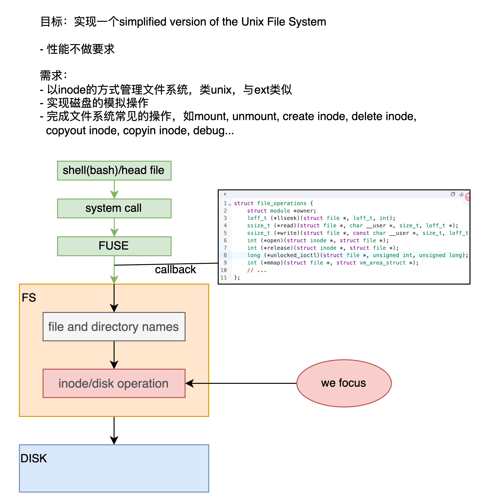
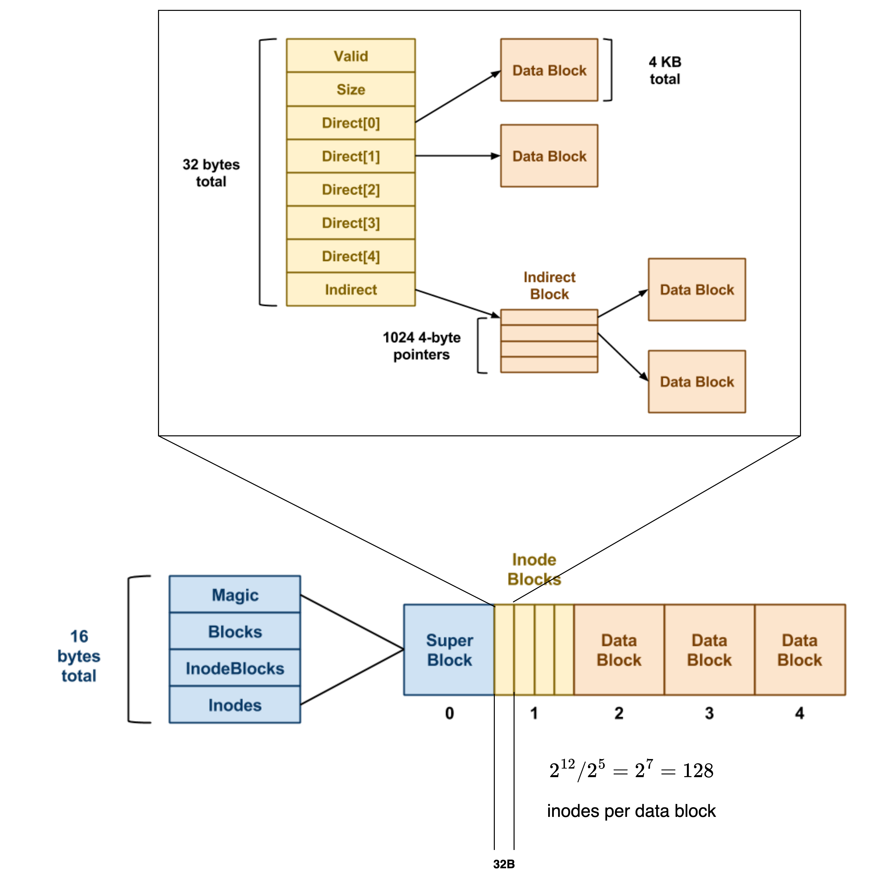
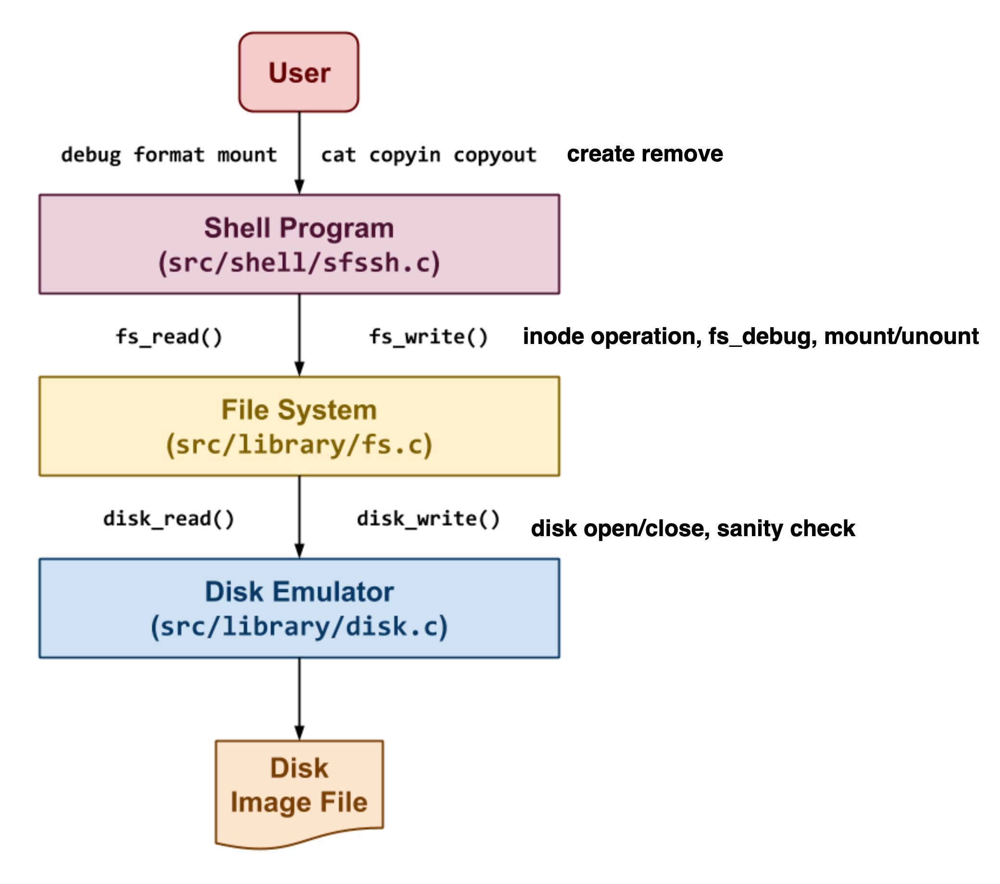
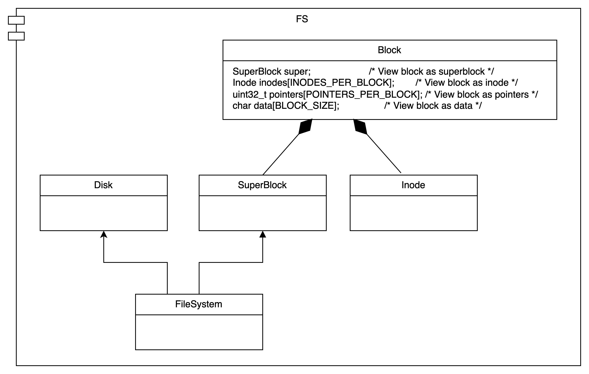
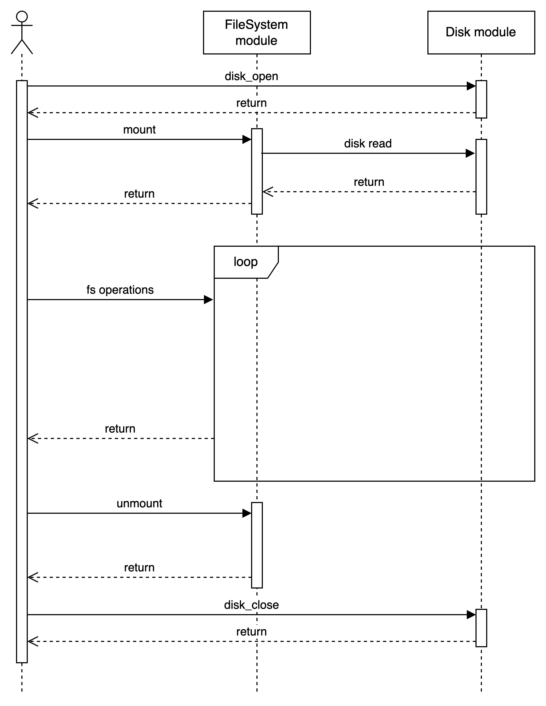

## Project 06: Simple File System

This is a solution for [Project 06] of [CSE.30341.FA19].

pass all shell-test.

[Project 06]:       https://www3.nd.edu/~pbui/teaching/cse.30341.fa19/project06.html
[CSE.30341.FA19]:   https://www3.nd.edu/~pbui/teaching/cse.30341.fa19/

## requirement analysis

## design

### fs-design

### arch

### uml diagram

